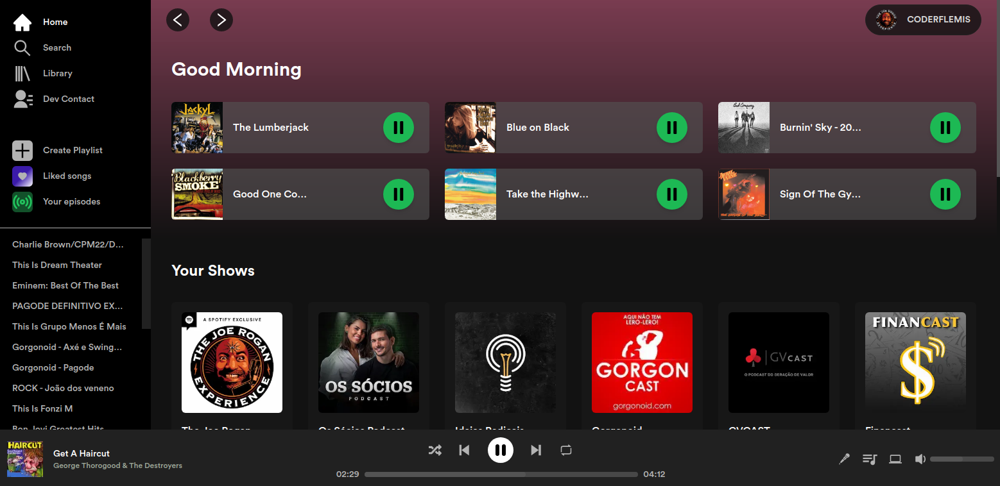

# Spotify Clone

## A Full Stack Spotify Clone App using **Spotify Api**

## Tech Stack

### Frontend

- NextJS
- Tailwind
- Daisyui
- Typescript

### Backend

- Next Api Routes
- Spotify Api
- Next-Auth with Spotify OAuth

### Deployment

- Frontend and Backend on Vercel

## Installation

To use this project some enviroment variables are required. You can see that on **.env.example**

## Usage

- Log in with your spotify account and use **Spotify Clone**
